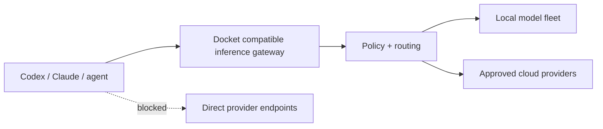
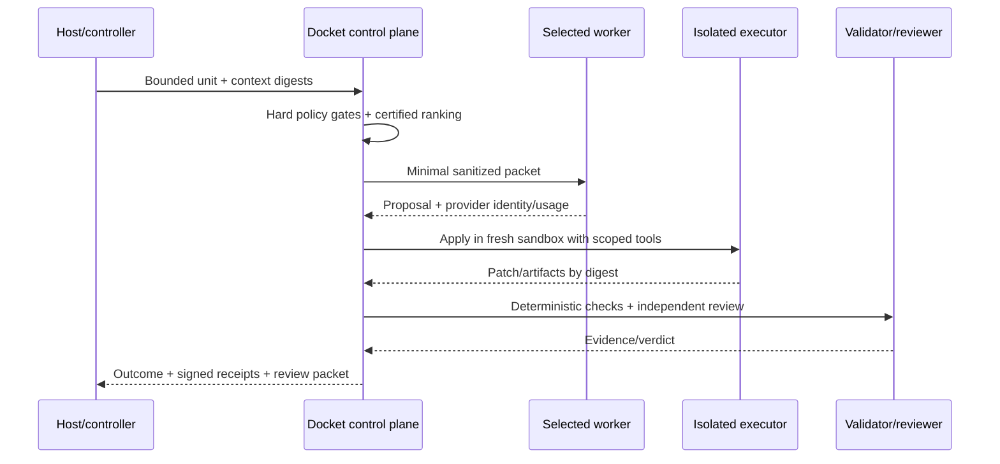

# ADR-001: route bounded work units through an explicit control plane

- Status: accepted for implementation
- Date: 2026-08-13
- Owners: Docket architecture and security
- Decision scope: host integrations, routing, inference, execution, validation, and receipts

## Context

Docket must work with Codex, Claude Code, other coding agents, local models, and hosted providers. Users want automatic model selection: for example, a difficult authentication change should use a stronger coding/review route while a Markdown update should use a fast, inexpensive route.

Connecting an MCP server does not mechanically replace the host model or guarantee tool invocation. MCP defines a host/client/server protocol for exposing context, tools, and prompts; it does not dictate how a host manages its LLM. The MCP documentation states that the language model decides whether to call a tool and that the host executes the selected tool ([MCP architecture overview](https://modelcontextprotocol.io/docs/learn/architecture), [client example](https://modelcontextprotocol.io/docs/develop/build-client)).

There are three distinct requirements:

1. **Convenience:** the host should automatically delegate eligible bounded units without repeated user model-picking.
2. **Proof:** the user must see which worker was requested, which model/provider actually reported execution, and how the output was validated.
3. **Enforcement:** administrators must be able to prevent direct, unreceipted provider traffic for managed agent runs.

Those requirements cannot be met reliably by a prompt convention or MCP tool alone.

## Decision

Docket routes **bounded work units** through an explicit control plane. The host model remains the controller. A selected worker model returns a proposal for one unit; Docket executes and validates that proposal under a separate isolation and policy boundary.

The routing boundary is the tuple:

```text
work-unit contract
+ signed policy version
+ certified deployment identity
+ attempt-specific authority/budget/deadline
+ required validation plan
```

The control plane owns:

- work-unit admission and idempotency;
- data/risk/provider/region/license/capability/budget gates;
- model selection and provider adapter invocation;
- attempt leases, cancellation, retries, and cost reservations;
- sandbox/tool authority;
- deterministic validation and independent review;
- signed route/attempt/validation/approval receipts.

Host integrations are adapters:

- An MCP tool offers voluntary delegation, route preview, status, and receipt access.
- A Codex/Claude skill or reviewed hook makes delegation workflow-automatic when the host supports that behavior.
- A CLI/IDE SDK can submit units directly.
- An OpenAI/Anthropic-compatible gateway can enforce provider traffic at the network/API boundary.

No adapter can weaken control-plane policy.

## Why bounded work units

Routing an entire conversation couples model selection to an ever-growing, mutable transcript. It increases cache/context cost, privacy exposure, and drift, and makes validation and replay ambiguous. GitHub's own auto-selection documentation notes that it routes along natural cache boundaries because switching mid-session can increase cost without commensurate quality improvement ([GitHub Copilot auto model selection](https://docs.github.com/en/copilot/concepts/models/auto-model-selection)).

A bounded unit instead has explicit objective, context digests, acceptance criteria, authority, budget, deadline, and validation. This gives Docket a stable payload for routing, idempotency, receipts, recovery, and outcome learning.

Units are not split mechanically by file or message. A code change and the focused tests encoding its invariant remain one unit. Documentation is a later independent unit only after behavior is verified.

## Mechanical enforcement

### Personal/local mode

The host can call Docket through MCP/CLI and direct provider access may remain possible. Automation is best-effort workflow behavior:

```text
host model -> decides/delegates -> Docket control plane -> selected worker
```

The receipt proves any delegated attempt. It cannot prove that the host never made an unrelated direct call.

### Managed/enforced mode

All provider traffic for managed agents must pass through the Docket inference gateway:



Enforcement requires controls outside the LLM:

- do not distribute raw provider keys to the host or worker;
- issue hosts scoped gateway credentials only;
- block direct provider domains/IP paths with device, container, VPC, or egress policy;
- proxy DNS/TLS according to enterprise policy;
- broker provider credentials inside the gateway;
- alert on non-gateway egress and reject unreceipted completion artifacts in CI/release gates.

If the user authenticates a desktop host directly to a vendor subscription outside the gateway, Docket cannot truthfully claim complete enforcement. The UI must label that environment `advisory` rather than `enforced`.

## Route lifecycle



The worker has no authority to write the user's checkout, publish, merge, deploy, or approve itself. The controller integrates only accepted artifacts.

## Routing policy

Hard gates run before ranking:

1. Tenant/project policy and data class.
2. Locality, provider, region, retention, and license requirements.
3. Risk tier and required independent validation.
4. Exact certified deployment capabilities and context/output limits.
5. Credential/capacity health and worst-case budget.

Eligible deployments are ranked on expected verified outcome, total cost including retries/validation/human review, latency, and observed reliability. A request mode such as `economy`, `balanced`, `quality`, or `private` changes ranking but cannot relax hard gates.

`private` applies only to the delegated worker route. It does not make the Codex/Claude host local or change where already submitted host context was processed.

## Retry, fallback, and cancellation

- Every retry or fallback is a new attempt with a new receipt.
- A provider-reported model mismatch quarantines output unless policy explicitly permits a named substitution.
- Safety refusals and policy denials never fall through to a less restrictive provider.
- Retry budgets, spawn depth, children, tool calls, wall time, output tokens, and total cost are finite.
- Cancellation is durable: stop admission, revoke tool/credential grants, signal provider/executor, then destroy a non-cooperative sandbox after a grace period.
- Stale workers are blocked by lease fencing and cannot commit accepted artifacts or side effects.

## Validation boundary

- A worktree protects the user's checkout but does not sandbox untrusted commands.
- Code executes in the per-attempt container/microVM specified in [security.md](security.md).
- Deterministic test plans are trusted inputs pinned by digest and run outside the worker's authority.
- Security, authentication, concurrency, migrations, and critical changes require a different reviewer attempt/model-provider where available or a qualified human.
- Worker self-confidence never satisfies validation.
- Accepted outcomes feed routing only after objective evidence; model self-rating and hidden reasoning are excluded.

## Receipt boundary

Every route records:

- controller identity (informational where host-reported);
- route policy/constraints and eligible/rejected deployments;
- selected deployment and selection reasons;
- requested and provider-reported model;
- local/cloud environment, model/runtime/certificate digests where available;
- request/context/tool/policy fingerprints;
- attempts, fallbacks, usage, cost, latency, artifacts, validation, and approvals.

The detailed protocol is defined in [receipts.md](receipts.md). A provider-reported model is evidence, not cryptographic proof of execution.

## Consequences

### Positive

- Automatic delegation is portable across hosts without pretending to replace their controller model.
- Users see the exact worker switch, fallback, validation, cost, and result.
- Local/open-weight and hosted models compete under one capability and policy contract.
- Small documentation work does not inherit the cost/context of a deep coding session.
- Independent validation and immutable receipts make model choice accountable.
- Managed deployments can enforce policy by controlling credentials and network egress.
- Outcome learning operates on comparable work units and verified outcomes.

### Costs and trade-offs

- Decomposition and validation add latency and control-plane complexity.
- Gateway enforcement can reduce direct vendor features and requires compatible APIs/adapters.
- Local model capability varies by quantization, template, runtime, and hardware, requiring continuous certification.
- Exactly-once effects require idempotency at every tool/provider boundary.
- Strong sandboxing and independent review cost compute but remain mandatory for high-risk work.
- Some desktop/subscription authentication flows cannot be transparently proxied; those environments remain advisory.

## Rejected alternatives

### MCP-only automatic switching

Rejected as an enforcement architecture. MCP exposes tools/context, while the host/model decides tool use. It remains a useful voluntary integration.

### One “manager” model directly running all agents

Rejected because orchestration, policy, authority, retries, cancellation, and audit cannot rely on one fallible context window.

### Proxy every token and switch models inside one conversation

Rejected as the default because provider prompt formats, tool semantics, context caches, hidden state, and billing differ. It also weakens work-unit validation and provenance. The gateway may preserve a compatible host API, but selection occurs per bounded unit/attempt.

### Manual model picker only

Rejected as the primary UX. It places a rapidly changing capability/cost decision on every user and does not learn from outcomes. Manual selection remains an override among policy-eligible deployments.

### Git worktrees as the execution sandbox

Rejected. Worktrees isolate branches and diffs, not processes, host files, credentials, network, or side effects.

### Worker self-review

Rejected for required validation. It is correlated with generation and provides no independent evidence.

### Fully autonomous online-learning router

Rejected for production. Policy changes are trained offline, shadow evaluated, signed, promoted, and reversible. Exploration is limited to low-risk work and never expands authority.

## Acceptance criteria

- [ ] Host integrations show “controller unchanged” and the delegated worker separately.
- [ ] A bounded unit includes objective, inputs, acceptance, authority, budget, risk/data class, and validation plan.
- [ ] An MCP-connected host works in advisory mode without false enforcement claims.
- [ ] Managed mode blocks direct provider credentials/egress and issues only gateway credentials.
- [ ] Every attempt, fallback, denial, and cancellation has a verifiable receipt.
- [ ] Model substitution is visible and quarantined according to policy.
- [ ] Code runs only in a real sandbox; no documentation calls a worktree a security sandbox.
- [ ] High-risk units cannot complete without deterministic and independent evidence.
- [ ] Router failure falls back only to a policy-approved static/manual path, never bypassing hard gates.

## Revisit triggers

Revisit this decision if a host exposes a standardized, enforceable per-work-unit routing contract; providers support interoperable cryptographic model-execution attestations; or a new protocol makes the gateway unable to preserve required host features. Such changes may improve adapters or receipts but do not remove the need for bounded authority and independent validation.

