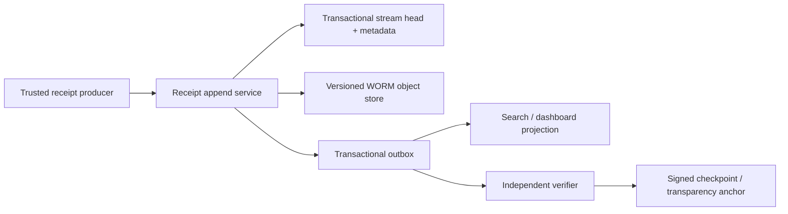

# Docket proof-of-work receipts

Status: proposed protocol v1  
Last reviewed: 2026-08-13

## What a receipt proves

A Docket receipt is durable, tamper-evident evidence that the control plane recorded a particular route, attempt, validation, approval, or cancellation under a specific policy and input fingerprint.

A receipt can prove:

- which controller requested a bounded unit;
- which deployment Docket selected and why;
- which model the adapter requested and which model the provider reported;
- what immutable inputs, tools, policy, runtime, and validation plan were bound to the attempt;
- what artifacts and test evidence were produced;
- how much time, token usage, and cost were reported;
- whether retries, fallbacks, escalations, approvals, or cancellation occurred;
- that the stored record has not been changed without breaking its hash chain/signature.

A receipt **does not** prove that a hosted provider executed the claimed neural weights. `providerReportedModel` is provider evidence, not cryptographic attestation. For local deployments, weight and runtime digests strengthen identity, but proving the computation itself requires a separately designed trusted-execution or verifiable-inference system.

## Design requirements

1. Receipts are generated by trusted control-plane services, never by a worker model.
2. Every terminal attempt has a receipt, including failures, denials, timeouts, and cancellations.
3. Requested, selected, and provider-reported identities are separate fields.
4. Raw prompts, source code, secrets, and hidden reasoning are excluded by default; content-addressed fingerprints bind external artifacts.
5. Integrity is independently verifiable from an export bundle.
6. Search/index storage is not evidence storage.
7. Corrections append a superseding receipt; they never mutate history.
8. Schema evolution is explicit and old receipts remain verifiable.

## Receipt families

| Kind | Emitted when | Core evidence |
| --- | --- | --- |
| `route` | A work unit is admitted, rejected, or planned | Constraints, eligible/rejected candidates, selected deployment, reason, budget reservation |
| `attempt` | One model/executor attempt reaches a terminal state | Requested/actual identity, usage, tools, sandbox, output artifacts, failure/fallback |
| `validation` | A deterministic or independent review completes | Plan/version, evidence digests, verdict, reviewer independence |
| `approval` | A human grants, denies, or expires a sensitive action/release | Actor, exact subject/action/arguments digest, auth context, expiry |
| `cancellation` | Authority is revoked and runtime termination is observed | Requester, propagation events, credential revocation, sandbox outcome |
| `feedback` | Delayed objective outcome is attached | Merge/acceptance, edits, rollback, regression, human label provenance |
| `correction` | A factual metadata error is corrected | Prior receipt ID/digest, corrected fields, authority, reason |

Each family uses one signed envelope and a versioned `payload` schema.

## Canonical envelope

The normative envelope is JSON encoded as UTF-8 and canonicalized with [RFC 8785 JSON Canonicalization Scheme](https://www.rfc-editor.org/rfc/rfc8785.html) before hashing.

```json
{
  "schema": "urn:aos:receipt:v1",
  "receiptId": "rcpt_01J5Y7XK3V0N8P4T2Q6M9A1BCE",
  "kind": "attempt",
  "stream": {
    "tenantId": "ten_01J...",
    "projectId": "prj_01J...",
    "streamId": "ledger_ten_01J..._2026_08",
    "sequence": "0000000000004217"
  },
  "subject": {
    "runId": "run_01J...",
    "workUnitId": "wu_01J...",
    "attemptId": "att_01J..."
  },
  "recordedAt": "2026-08-13T10:42:18.419Z",
  "actor": {
    "type": "service",
    "id": "docket-orchestrator",
    "workloadIdentity": "spiffe://docket.prod/ns/control/sa/orchestrator"
  },
  "payload": {},
  "integrity": {
    "canonicalization": "RFC8785",
    "bodyDigest": "sha256:<64-hex>",
    "previousChainDigest": "sha256:<64-hex-or-genesis>",
    "chainDigest": "sha256:<64-hex>",
    "signatureAlgorithm": "Ed25519",
    "signingKeyId": "kms://docket-receipts/2026-08",
    "signature": "base64url:<signature>"
  }
}
```

IDs are opaque. Sequence is serialized as a decimal string to avoid cross-language integer precision loss. Timestamps are UTC RFC 3339 with milliseconds; duration fields use integer milliseconds from a monotonic clock.

## Attempt payload v1

The attempt payload exposes the complete model switch without implying that the host model changed:

```json
{
  "status": "succeeded",
  "controller": {
    "kind": "codex",
    "sessionIdHash": "sha256:<digest>",
    "reportedModel": "host-reported-model-id"
  },
  "route": {
    "mode": "balanced",
    "policyVersion": "policy-2026-08-13.3",
    "policyDigest": "sha256:<digest>",
    "dataClass": "internal",
    "risk": "medium",
    "requiredCapabilities": ["code", "tools", "json_schema"],
    "selectedDeploymentId": "dep_qwen36_fp8_sglang_h200_v3",
    "selectionReasonCodes": ["CAPABILITY_MATCH", "LOWEST_VERIFIED_TOTAL_COST"],
    "constraintFingerprint": "sha256:<digest>"
  },
  "model": {
    "publisher": "Qwen",
    "requestedModel": "Qwen/Qwen3.6-35B-A3B-FP8",
    "providerReportedModel": "Qwen/Qwen3.6-35B-A3B-FP8",
    "provider": "docket-local",
    "executionEnvironment": "local",
    "region": "on-device",
    "weightDigest": "sha256:<digest>",
    "runtimeImageDigest": "sha256:<digest>",
    "certificateId": "cert_01J..."
  },
  "inputs": {
    "workUnitContractDigest": "sha256:<digest>",
    "sourceRevision": "git:<full-commit-id>",
    "contextFingerprint": "sha256:<digest>",
    "contextItems": [
      {
        "name": "auth-interface",
        "mediaType": "text/plain",
        "digest": "sha256:<digest>",
        "bytes": 4218,
        "dataClass": "internal"
      }
    ],
    "toolManifestDigest": "sha256:<digest>",
    "validationPlanDigest": "sha256:<digest>"
  },
  "execution": {
    "providerRequestId": "req_provider_opaque",
    "requestFingerprint": "sha256:<digest>",
    "idempotencyKeyHash": "sha256:<digest>",
    "startedAt": "2026-08-13T10:39:02.010Z",
    "finishedAt": "2026-08-13T10:42:17.992Z",
    "latencyMs": 195982,
    "finishReason": "stop",
    "usage": {
      "inputTokens": 18420,
      "cachedInputTokens": 0,
      "outputTokens": 3112,
      "reasoningTokens": null,
      "reportedBy": "provider"
    },
    "cost": {
      "currency": "USD",
      "estimatedMicros": "380000",
      "billedMicros": null,
      "priceCardDigest": "sha256:<digest>"
    },
    "sandbox": {
      "class": "standard",
      "runtime": "gvisor",
      "executorImageDigest": "sha256:<digest>",
      "workspaceSourceDigest": "sha256:<digest>",
      "networkProfile": "dependency-proxy-only",
      "networkPolicyDigest": "sha256:<digest>"
    },
    "toolCalls": [
      {
        "tool": "test.run",
        "manifestDigest": "sha256:<digest>",
        "argumentsDigest": "sha256:<digest>",
        "resultDigest": "sha256:<digest>",
        "outcome": "succeeded",
        "sideEffectId": null
      }
    ],
    "egress": [
      {
        "policyDestination": "packages.internal.example",
        "bytesOut": 1210,
        "bytesIn": 482103,
        "decision": "allowed"
      }
    ]
  },
  "outputs": {
    "proposalDigest": "sha256:<digest>",
    "patchDigest": "sha256:<digest>",
    "artifactRefs": ["artifact://sha256/<digest>"],
    "workerConfidence": 0.83,
    "assumptionCount": 2
  },
  "lineage": {
    "parentWorkUnitId": "wu_01H...",
    "previousAttemptId": null,
    "fallbackFromAttemptId": null,
    "spawnDepth": 0
  },
  "validationSummary": {
    "state": "passed",
    "validationReceiptIds": ["rcpt_01J..."],
    "independentReview": true
  },
  "warnings": []
}
```

The controller's reported model is informational because host APIs may not expose cryptographically verifiable identity. The worker route is independently shown as local/cloud, provider, requested model, provider-reported model, deployment certificate, and artifact/runtime digests.

### Required fields by outcome

| Outcome | Additional requirements |
| --- | --- |
| `succeeded` | Model identity, request fingerprint, usage status, output digest, validation state |
| `failed` | Failure category, bounded error digest, retryability decision, charged usage/cost if any |
| `cancelled` | Cancellation receipt ID, revocation time, provider acknowledgement, sandbox termination outcome |
| `denied` | Policy version, denial reason codes, zero provider attempts |
| `escalation_required` | Reason, exhausted/blocked constraints, no claim of successful output |
| `provider_substitution` | Requested and reported model mismatch, quarantined output, policy response |

Nullable fields are explicit where a provider does not report data. `0` is never used to mean “unknown.”

## Route payload v1

A route receipt records the decision before execution:

- task kind and tier floor;
- data class, risk, routing mode, region/provider/license/capability constraints;
- context and constraint fingerprints;
- policy version/digest;
- every evaluated deployment ID with stable eligible/rejected reason codes;
- selected deployment and score components;
- estimated maximum cost, validation reserve, recovery reserve, and price-card digest;
- idempotency key hash;
- whether the decision was `planned`, `admitted`, `denied`, or `manual_override`.

Human-readable explanations are derived from reason codes and may be localized. They are not used to reconstruct the decision.

## Validation payload v1

```json
{
  "validator": {
    "type": "deterministic_and_model",
    "planId": "docket-auth-validation-v4",
    "planDigest": "sha256:<digest>",
    "trustedImageDigest": "sha256:<digest>"
  },
  "subject": {
    "attemptReceiptId": "rcpt_01J...",
    "sourceRevision": "git:<commit>",
    "patchDigest": "sha256:<digest>"
  },
  "checks": [
    {
      "name": "auth-focused-tests",
      "commandDigest": "sha256:<digest>",
      "exitCode": 0,
      "reportDigest": "sha256:<digest>",
      "durationMs": 34112,
      "outcome": "passed"
    }
  ],
  "review": {
    "reviewAttemptReceiptId": "rcpt_01J...",
    "independence": "different_model_and_provider",
    "verdict": "accept",
    "findingDigests": []
  },
  "finalVerdict": "passed",
  "evidenceComplete": true
}
```

`passed` requires every mandatory deterministic check and required independent review. Applicability-only validation is `partial`. A worker's self-reported confidence is never validation evidence.

## Approval payload v1

Approval is bound to an exact action, not a conversational statement:

- approver principal and organization role;
- fresh authentication method/context ID (no raw credential);
- subject receipt/artifact digest;
- operation and canonical arguments digest;
- scope, maximum calls, not-before/expiry, and optional environment;
- policy version and required number of approvers;
- decision (`approved`, `denied`, `expired`, `revoked`);
- superseded approval IDs.

Changing the patch, target, operation, arguments, environment, or expiry invalidates the approval. Model/tool output cannot mint an approval receipt.

## Fingerprints and content storage

### Fingerprint construction

- Hash exact bytes with SHA-256 and prefix the algorithm: `sha256:<lowercase-hex>`.
- A context fingerprint is SHA-256 over an RFC 8785 canonical manifest containing ordered item name, media type, byte length, classification, and content digest.
- A request fingerprint covers the exact normalized provider request after model-specific rendering but before transport encoding. It excludes transport credentials and unstable request IDs.
- A constraint fingerprint covers normalized routing constraints and signed policy digest.
- Directory/source fingerprints use a canonical sorted manifest of path, mode, type, and content digest; never hash an ambiguous string concatenation.

### Content policy

Receipts carry digests and safe metadata, not raw content. When reproducibility requires content:

- store it as a separately encrypted content-addressed artifact;
- copy the source data class, tenant, region, retention, and legal-hold policy;
- issue scoped, expiring access URLs after authorization;
- record access as its own audit event;
- delete the encryption key/content according to policy without rewriting the historical receipt.

Prompt and output retention defaults to off for external model traffic logs. Operators must not put raw prompts, source, user IDs, secrets, or tool output into metrics labels or `traceparent`/`tracestate`; the [W3C Trace Context privacy guidance](https://www.w3.org/TR/trace-context/#privacy) prohibits sensitive information in trace headers.

## Integrity chain and signature

### Canonicalization

1. Validate the receipt against the exact schema version.
2. Remove `integrity.bodyDigest`, `integrity.chainDigest`, and `integrity.signature`; retain declared algorithms/key ID.
3. Canonicalize the remaining object with RFC 8785.
4. Compute `bodyDigest = SHA-256(canonical_body)`.

### Chain construction

To avoid concatenation ambiguity, encode each field as a fixed tag plus an 8-byte big-endian length followed by its bytes:

```text
chainInput = frame("docket-receipt-chain-v1")
           || frame(streamId)
           || frame(sequenceDecimal)
           || frame(previousChainDigestBytes)
           || frame(bodyDigestBytes)

chainDigest = SHA-256(chainInput)
signature = Sign(signingKey, chainDigest)
```

The first receipt uses a documented genesis digest. Append acquires a serializable lock on the stream head, verifies expected sequence/previous digest, writes the receipt and new head atomically, then publishes an outbox event. Gaps, duplicates, forks, invalid signatures, and unexpected key transitions fail verification.

### Keys

- Signing keys live in KMS/HSM; application services receive signing capability, never exportable private keys.
- Key IDs resolve to public keys, algorithm, validity, revocation, and rotation metadata.
- Rotation appends a key-transition receipt signed by both old and new keys where possible.
- Tenant-dedicated keys are supported for regulated deployments.
- A signing outage fails closed for high-risk completion. Low-risk work may remain `receipt_pending` only under an explicit policy and cannot be released until signed.

Signatures and a hash chain make mutation evident; they do not make an operator incapable of withholding an entire suffix. Periodic signed checkpoints should be anchored to a separately administered transparency/WORM system. Sigstore's design is a useful precedent for persisting artifact digests, signatures, and certificates in an immutable append-only transparency log ([Sigstore overview](https://docs.sigstore.dev/)).

## Storage architecture



- Receipt bodies are immutable objects named by body digest and stored with retention/object-lock policy.
- PostgreSQL stores stream order, heads, subject indexes, and object references.
- Search indexes contain a redacted projection and can be deleted/rebuilt.
- Ledger credentials are not available to executors, inference servers, model workers, or ordinary project administrators.
- Backups preserve object versions, stream heads, keys/public certificates, schemas, and checkpoint proofs.

The structure borrows the useful separation in [SLSA provenance](https://slsa.dev/spec/v1.0/provenance) between the definition/inputs of work and details of a particular run, while remaining a Docket-specific agent receipt rather than claiming SLSA compliance.

## Verification algorithm

An offline verifier receives receipts, referenced schemas, public keys/certificates, and checkpoint proofs:

1. Validate JSON and reject duplicate keys, unknown critical fields, invalid timestamps/IDs, and schema mismatch.
2. Recompute each body digest from RFC 8785 canonical JSON.
3. Recompute chain digest from stream ID, sequence, previous digest, and body digest.
4. Verify signature and key validity at `recordedAt`, including transition/revocation rules.
5. Verify strictly increasing contiguous sequence from the checkpoint/genesis.
6. Verify object/artifact digests where bytes are present.
7. Check route-to-attempt-to-validation lineage and terminal-state rules.
8. Report unavailable evidence distinctly from invalid evidence.

Verifier output is machine-readable:

```json
{
  "valid": true,
  "streamId": "ledger_ten_01J..._2026_08",
  "fromSequence": "0000000000004000",
  "toSequence": "0000000000004250",
  "verifiedReceipts": 251,
  "missingArtifacts": 0,
  "warnings": []
}
```

## Corrections and schema evolution

- Published receipts are never edited or deleted from the evidence stream.
- A correction names the prior receipt/body digest, reason code, corrected field/value digest, and authorized actor. Projections show the latest interpretation while preserving both records.
- A major schema URI change is required for incompatible semantics.
- Verifiers reject unknown critical fields and preserve unknown non-critical fields.
- Schema files are immutable, signed, and archived by digest.
- Canonicalization and hash algorithms are versioned. Migration begins a new chain with a signed bridge receipt, not an in-place rewrite.

## Privacy, retention, and access

Baseline policy:

- raw prompts/source/tool bodies: not stored in receipts; separate artifact retention only when explicitly required;
- receipt metadata: retained according to tenant audit/contract policy;
- cost/usage: least-privilege finance and project views;
- security receipts: separate security access role;
- provider request IDs: treated as internal identifiers;
- user identity: stable internal principal ID, with display data resolved separately;
- export: redacted by data class, with export action itself receipted.

Deletion requests remove separately stored content and identifying directory data where policy permits. The ledger may retain non-identifying digests and required audit evidence; tenant contracts and UI must explain this before collection. Legal hold overrides automated deletion only through an authorized, auditable policy.

## Dashboard contract

For every work unit, the UI should make the switch visible in one compact line:

```text
Controller: Codex (host unchanged)
Worker: Qwen3.6-35B-A3B-FP8 · local/SGLang
Reviewer: gpt-oss-120b · on-prem/vLLM
Why: balanced coding route; 94% certified acceptance; lowest expected verified cost
Proof: rcpt_01J... · tests 38/38 · $0.38 est. · 3m16s
```

Users can expand it to see requested versus provider-reported model, retries/fallbacks, input/artifact digests, tool calls, network policy, validation, cost source, policy version, and signature status. A fallback is a visible new attempt, never a rewritten badge.

## Operational alarms

Page security or reliability owners on:

- missing receipt for a terminal attempt;
- invalid chain, signature, key transition, duplicate sequence, or ledger fork;
- requested/provider-reported model mismatch;
- receipt/body or artifact digest mismatch;
- stale worker submitting after lease fencing;
- approval used after expiry or against a different arguments digest;
- `passed` validation without all mandatory evidence;
- ledger write or signing latency threatening release SLO;
- search projection showing data not authorized by its receipt classification;
- excessive correction rate or correction by an unauthorized role.

## Implementation acceptance tests

- [ ] RFC 8785 test vectors and cross-language canonicalization agree byte-for-byte.
- [ ] Duplicate JSON keys and non-I-JSON values are rejected before signing.
- [ ] Concurrent appenders cannot create the same sequence or divergent heads.
- [ ] A changed byte in every normative field breaks verification.
- [ ] Key rotation, revocation, checkpoint, correction, and schema bridge verify offline.
- [ ] Provider substitution produces a quarantined mismatch receipt.
- [ ] Cancellation and failed attempts generate complete receipts without output artifacts.
- [ ] Redacted export verifies against the original via disclosed digests without leaking hidden content.
- [ ] Executor and tenant-admin credentials cannot modify or delete ledger objects.
- [ ] Search/database loss can be rebuilt from the immutable ledger and object store.
