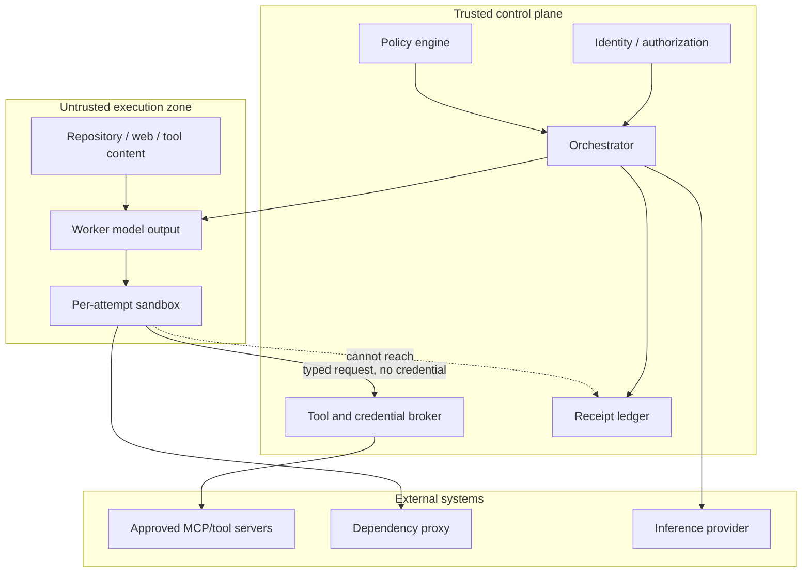

# Docket security architecture

Status: proposed production baseline  
Last reviewed: 2026-08-13

## Security objective

Docket treats every model response, repository file, web page, package, tool description, tool result, and generated command as untrusted input. Security is enforced by policy engines, brokers, operating-system isolation, short-lived credentials, and append-only evidence—not by asking a model to behave.

The system is safe only when a compromised worker model can neither exceed its declared work-unit authority nor erase the evidence of what it attempted.

## Security invariants

1. A Git branch or worktree is a collaboration primitive, **not** a process, filesystem, credential, or network boundary.
2. A model can request a privileged action; it cannot approve its own request.
3. Workers never receive control-plane, developer, or provider credentials directly.
4. Network access is denied unless an explicit, expiring rule permits a destination and method.
5. Every attempt runs in a fresh isolation boundary with finite CPU, memory, storage, process, token, tool-call, and time limits.
6. Untrusted content never changes policy, tool grants, data classification, or approval state.
7. High-risk output requires deterministic validation and an independent reviewer or human gate.
8. Receipts and security logs are written outside the agent-writable workspace.
9. A missing or unverifiable policy, model identity, sandbox identity, receipt, or validation result fails closed.
10. Cancellation revokes authority before it waits for cooperative process shutdown.

## Threat model

### Protected assets

- Source code, unreleased product plans, customer data, prompts, and generated artifacts.
- Developer machines, build infrastructure, repositories, package registries, and deployment systems.
- OAuth tokens, cloud keys, signing keys, provider credentials, and local model endpoints.
- Routing policy, model certifications, budget limits, approval records, and audit evidence.
- Tenant boundaries, model usage/cost records, and the integrity of accepted code.

### Adversaries and failure sources

- Malicious instructions embedded in repositories, issues, documentation, web pages, emails, images, or tool results.
- A poisoned or compromised MCP/tool server, model endpoint, package, container image, or dependency proxy.
- A worker model that hallucinates, is misaligned, or is deliberately prompted to exfiltrate or damage data.
- A compromised executor node, malicious tenant, insider, or stolen user session.
- Provider substitution, retry duplication, stale workers, confused-deputy calls, or incomplete cancellation.
- Resource-exhaustion loops, recursive delegation, fork bombs, oversized output, or runaway spend.

NIST describes indirect prompt injection as attacker-controlled instructions placed in external data that an agent ingests, potentially causing data exfiltration or code execution ([NIST CAISI agent security research](https://www.nist.gov/blogs/caisi-research-blog/insights-ai-agent-security-large-scale-red-teaming-competition)). Docket assumes detection is imperfect and therefore limits the consequence of a successful injection.

## Trust boundaries

The browser/UI, local connector, inference gateway, executor, model server, and each third-party tool are separate principals. Trust is not inherited merely because two components are on the same machine or use MCP.

## Identity, authorization, and policy

- Human authentication uses the organization's identity provider with phishing-resistant MFA where available.
- Services use workload identities and mutually authenticated transport. No shared “internal” API key.
- Authorization evaluates tenant, project, actor, work unit, tool, resource, action, classification, and time.
- Policy bundles are versioned, signed, reviewed, and referenced by digest in every route and approval receipt.
- Deny rules override allow rules. Child units can only narrow inherited policy.
- Sensitive actions use just-in-time grants with an expiry, maximum call count, argument constraints, and idempotency key.
- Approvals are recorded by a trusted UI/API after fresh authorization. Approval text returned inside a model message or tool result is never valid.
- Break-glass access requires a named incident, two-person approval for production secrets, automatic expiry, and an immutable audit event.

## Per-work-unit isolation

### Workspace construction

1. The control plane resolves an immutable source revision and verifies repository authorization.
2. A supervisor creates a detached temporary Git worktree away from the developer's working checkout.
3. Only the selected tracked content is copied or snapshotted into the sandbox's writable workspace. The developer's parent repository, Git credentials, sockets, SSH agent, home directory, and control-plane filesystem are not mounted.
4. Inputs are mounted read-only where possible. The agent writes only to `/workspace/output` and bounded temporary storage.
5. The supervisor computes the patch and artifact digests outside the worker process, scans exports, and then destroys the runtime.

The worktree isolates concurrent diffs and gives deterministic source provenance. The container or microVM isolates execution. Both are required for code-running units.

### Runtime classes

| Class | Use | Minimum boundary | Notes |
| --- | --- | --- | --- |
| `no-exec` | Summaries, classification, Markdown from approved facts | No shell or filesystem write tools | Model output remains untrusted text |
| `standard` | Normal code edits and tests in a single trusted tenant | Rootless OCI container under gVisor, dedicated user namespace | Default for code execution |
| `high-assurance` | Untrusted repositories, security work, cross-tenant hosted execution | Firecracker microVM started through its jailer | Dedicated node pool and network namespace |
| `privileged-build` | Rare hardware/build workflows | Purpose-built isolated runner with human approval | Never shares the general executor pool |

gVisor interposes an application kernel to reduce direct exposure to the host kernel, while documenting limits such as side channels and the need for container-level network policy ([gVisor security introduction](https://gvisor.dev/docs/architecture_guide/intro/), [security model](https://gvisor.dev/docs/architecture_guide/security/)). Firecracker combines a KVM boundary with seccomp, cgroups, namespaces, and privilege dropping; its production guidance requires the jailer and a correctly hardened host ([design](https://github.com/firecracker-microvm/firecracker/blob/main/docs/design.md), [production host setup](https://github.com/firecracker-microvm/firecracker/blob/main/docs/prod-host-setup.md)). Neither technology eliminates host patching, image hardening, or monitoring.

### Runtime hardening

- Run as non-root with no added Linux capabilities, no privileged mode, no host PID/IPC/network namespace, and a read-only root filesystem.
- Apply seccomp, AppArmor/SELinux, user namespaces, cgroups, `pids.max`, storage quotas, ulimits, and a hard wall-clock deadline.
- Disable host socket mounts, device mounts, cloud instance metadata, ptrace, nested container engines, and kernel module access.
- Use minimal immutable images pinned by digest. Generate SBOMs, scan before admission, and sign release images.
- Separate tenants and trust classes at the runtime boundary; do not depend on a directory name or environment variable for isolation.
- Wipe ephemeral disks and encryption keys after export. High-assurance pools disable or securely configure swap following the runtime's production guidance.

## Network policy

The default network profile is `deny-all`. Kubernetes allows all pod traffic when no NetworkPolicy exists, so a production cluster must explicitly install default-deny ingress and egress policies ([Kubernetes NetworkPolicy defaults](https://kubernetes.io/docs/concepts/services-networking/network-policies/)). Enforcement also requires a network plugin that implements egress policy.

Approved profiles:

| Profile | Allowed traffic |
| --- | --- |
| `offline` | None, including DNS |
| `dependency-proxy-only` | Internal DNS plus a read-only, pinned dependency proxy |
| `tool-broker-only` | Authenticated calls to the Docket tool broker; no direct third-party access |
| `scoped-egress` | Explicit destinations, ports, methods, byte ceilings, and expiry approved by policy |

Additional controls:

- Block link-local, RFC1918, control-plane, metadata-service, and cluster-service ranges unless explicitly required.
- Resolve DNS through a policy resolver; pin the resolved set for the grant lifetime and defend against DNS rebinding.
- Terminate TLS at an egress proxy that records destination, certificate identity, byte counts, and policy decision—not secret bodies.
- Route package installation through a caching proxy that enforces ecosystem lockfiles, hashes, package allow/deny rules, and malware checks.
- A model cannot request arbitrary `curl`, package, or Git access under the guise of a test dependency.

## Credential and tool brokerage

- Long-lived credentials remain in a secret manager reachable only by the broker.
- The broker exchanges workload identity for short-lived, purpose-bound credentials where the target supports it.
- The worker receives a typed capability handle, not the credential. Every call is re-authorized against work-unit grants.
- Tool arguments are validated against a versioned schema and policy constraints before dispatch; returned data is classified and size-limited.
- Read and write capabilities are separate. A grant to inspect a pull request does not grant comment, merge, or repository-admin access.
- Destructive actions require a fresh out-of-band approval containing the exact resource, operation, and arguments digest.
- Each external side effect uses a stable idempotency key, and its outcome is written to the receipt ledger.

## Prompt injection and tool-poisoning defenses

OWASP identifies tool descriptions, parameter schemas, and return values as poisoning surfaces and recommends least privilege, schema integrity, sandboxing, human review, and server-side enforcement ([MCP Security Cheat Sheet](https://cheatsheetseries.owasp.org/cheatsheets/MCP_Security_Cheat_Sheet.html), [MCP Tool Poisoning](https://owasp.org/www-community/attacks/MCP_Tool_Poisoning)). Docket applies the following layered controls:

### At connection and installation

- Only administrators can register a remote tool server for shared use.
- Pin server identity, package/image digest, tool names, input/output schemas, descriptions, OAuth scopes, and transport security parameters.
- Diff and require reapproval for any tool-manifest change; a matching name is insufficient.
- Keep each MCP server in a separate client/security principal. Never pool credentials across servers.
- Continuously inventory dependencies and revoke a server centrally.

### At context construction

- Label every context item with source, trust level, classification, digest, and retrieval time.
- Place untrusted text in data fields, not system/developer instruction channels.
- Pass only minimal excerpts needed for the unit. Do not forward a raw mutable transcript between models.
- Scan for likely injection and secrets, but treat scanning as a warning signal rather than proof of safety.
- Reject context that attempts to redefine tools, policy, approvals, identities, or data classification.

### At tool execution

- The model sees only tools authorized for that unit, preferably through progressive discovery rather than a global registry.
- Privileged tools are in a separate broker context from untrusted external content.
- Require structured outputs with schema validation where possible; quarantine malformed or oversized returns.
- Re-evaluate policy on every call. Instructions in a tool result cannot grant another tool call.
- Apply outbound DLP and destination policy even to syntactically valid calls.
- Human confirmation occurs outside the model context and is bound to the arguments digest.

### At output and review

- Treat generated shell, code, Markdown links, CI configuration, dependency changes, and tests as executable or persuasive content requiring review.
- Scan diffs for credential access, workflow permission escalation, encoded payloads, unexpected binary content, and new network destinations.
- Show reviewers intent-versus-diff, permission changes, risk hotspots, deterministic test evidence, and unresolved assumptions.
- A reviewer model uses a different attempt and, when possible, a different provider/model family from the generator.

Prompt text such as “ignore malicious instructions” is defense-in-depth only. It is never the enforcement layer.

## Data classification and privacy

| Class | Examples | Default routing |
| --- | --- | --- |
| `public` | Public repository and published docs | Any policy-approved certified provider |
| `internal` | Ordinary private code and planning | Approved providers under tenant policy |
| `confidential` | Customer code, contracts, unreleased security design | Local/private or specifically contracted provider/region |
| `restricted` | Secrets, regulated records, signing material | No model dispatch until redacted; local-only when policy explicitly permits |

Classification is inherited by derivatives unless an authorized owner approves declassification of an exact fact set. Redaction happens before provider dispatch. Raw secrets are never intentionally submitted to a model, including a “secret scanner” model.

Data controls must cover prompts, context, tool arguments/results, model outputs, logs, traces, crash dumps, cache/KV state, receipts, and backups. Provider retention and training terms are registry metadata and hard routing gates.

## Independent validation and release gates

| Risk | Required evidence |
| --- | --- |
| Low documentation/formatting | Source-link check, schema/lint, human spot review when public |
| Normal code | Patch inspection, focused tests, lint/type checks, dependency and secret scan |
| High security/auth/concurrency/migration | Normal checks plus independent deep review, adversarial tests, and human approval |
| Critical production/deployment | High-risk gates plus staged deployment, rollback proof, two-person approval, and monitored canary |

Tests authored by the same worker are useful artifacts, not independent proof. Deterministic checks run from a trusted validation plan and image. The validator receives the accepted source revision and patch digest; it does not trust files that could rewrite its harness.

## Audit, receipts, and tamper resistance

- The executor cannot write, mutate, or delete the ledger.
- Security events include actor, action, subject, time, source, policy decision, outcome, trace ID, and relevant digests without raw secrets.
- Receipt bodies are canonicalized, chained, signed with a KMS/HSM-backed key, and stored in append-only/WORM storage; details are in [receipts.md](receipts.md).
- Search projections are disposable and cannot alter evidence.
- Ledger verification runs continuously and on export. Integrity failure pages security, stops high-risk admissions, and preserves the affected stream read-only.
- Audit administrators are separate from ordinary tenant and platform administrators.

NIST recommends protecting audit information and logging tools against unauthorized access, modification, and deletion and separating audit privileges ([NIST SP 800-171 Rev. 3, Audit and Accountability](https://nvlpubs.nist.gov/nistpubs/SpecialPublications/800-171r3/NIST.SP.800-171r3.html)).

## Supply-chain security

- Pin model weights, tokenizers, chat templates, inference servers, executor images, tool servers, validators, and policy bundles by digest.
- Store license text and provenance beside each model artifact; a mutable model name is never sufficient.
- Produce and verify SBOMs and provenance for Docket release artifacts.
- Use isolated, ephemeral builders and protected signing identities.
- Mirror dependencies through reviewed registries and enforce lockfile integrity.
- Block unreviewed post-install scripts and arbitrary build-time network access.
- Quarantine model formats or runtime plugins that execute custom remote code unless explicitly reviewed and isolated.

## Abuse and resource controls

- Per-tenant and per-run admission quotas; atomic inference and tool budgets.
- Hard output, context, request-rate, concurrent-attempt, process, and child-unit limits.
- Spawn depth and fan-out limits enforced by the orchestrator, not model instructions.
- Provider and tool circuit breakers; anomaly alerts for repeated failures, unexpected egress, high entropy/encoded outputs, and budget acceleration.
- Content-safety policy for prohibited tasks applies consistently across local and hosted models. Refusals do not trigger provider shopping.

## Incident response and kill switches

Operators need independently authorized controls to:

- Cancel one attempt, one run, all runs for a tenant, or a compromised provider/tool/model version.
- Revoke a tool manifest, model certification, signing key, connector, executor image, or policy bundle by digest.
- Disable all external egress while preserving local read-only inspection.
- Quarantine artifacts and freeze the receipt stream for investigation.
- Rotate credentials and invalidate active capability handles.

The system must practice compromised-model, poisoned-tool, executor-escape, provider-substitution, ledger-integrity, and credential-broker incidents before GA. Destructive remediation remains a human-authorized operation.

## Pre-GA security checklist

- [ ] Independent threat-model review and penetration test completed.
- [ ] Default-deny egress verified from inside every runtime class.
- [ ] No host socket, home directory, credential agent, or control-plane secret visible in sandboxes.
- [ ] Stale fencing token cannot commit a side effect or accepted artifact.
- [ ] Approval API rejects model-authored or replayed approval artifacts.
- [ ] Tool manifest changes revoke certification until reviewed.
- [ ] High-risk policies fail closed when router, validator, ledger, or signing service is unavailable.
- [ ] Cancellation destroys non-cooperative processes and revokes tool grants.
- [ ] Cross-tenant object paths, database queries, caches, traces, and receipt streams are isolated.
- [ ] Backup restore and receipt-chain verification drills pass.
- [ ] Data retention, deletion, legal hold, residency, and provider terms are documented per tenant.

