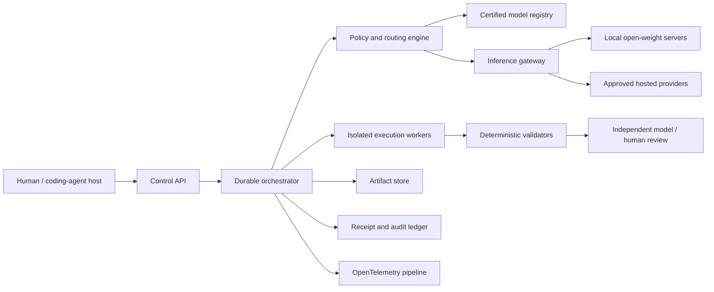
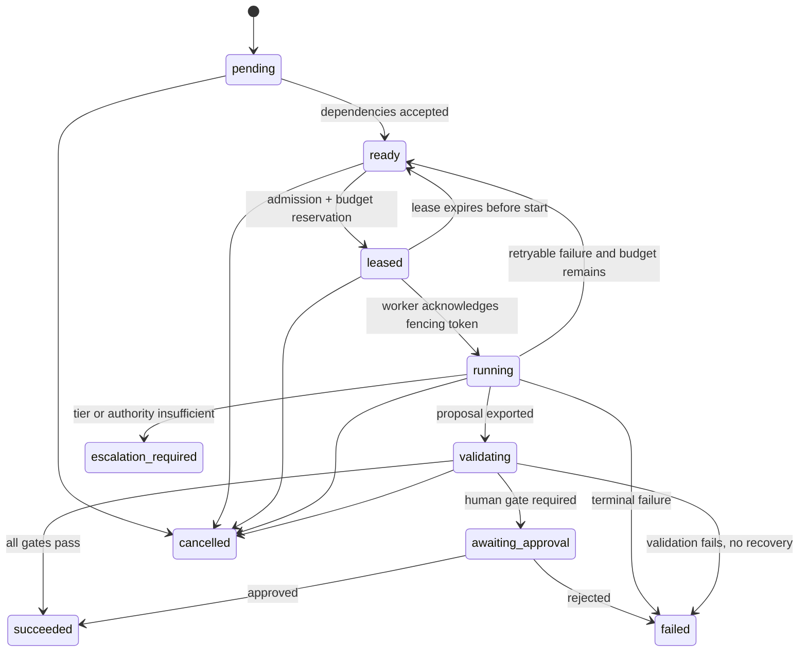
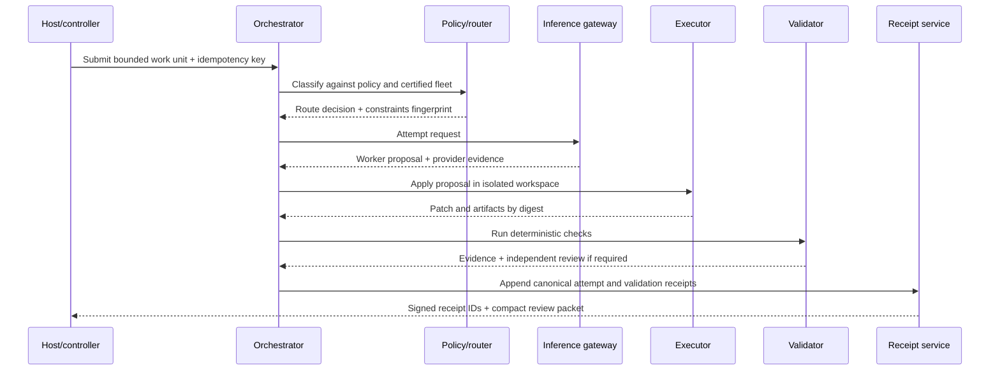

# Docket system architecture

Status: proposed production baseline  
Last reviewed: 2026-08-13

## Purpose

Docket is an auditable control plane for human and AI engineering work. It breaks a request into bounded work units, selects a policy-eligible worker model for each unit, runs code in an isolated workspace, validates the result, and presents a compact review packet to a human. The controller model remains the controller; a routed worker is a delegated attempt, not a silent replacement for the host conversation.

The architecture is designed around five promises:

1. **Durable:** a coordinator crash, worker loss, or provider timeout does not lose accepted work.
2. **Bounded:** every attempt has explicit inputs, authority, budget, deadline, and validation.
3. **Interruptible:** pause, cancel, and kill requests propagate through the full task graph.
4. **Auditable:** route, model, tools, artifacts, cost, validation, and approvals produce verifiable receipts.
5. **Provider-neutral:** local and hosted models use the same capability and receipt contracts.

## Terms

| Term | Meaning |
| --- | --- |
| Run | A user-visible objective represented as a directed acyclic graph (DAG). |
| Work unit | The smallest independently routable outcome with its own acceptance and validation criteria. |
| Attempt | One execution of a work unit by one selected model and executor. Retries create new attempts. |
| Controller | The host coding agent or Docket planner coordinating a run. It is not replaced by a worker. |
| Worker | A model executing one bounded work unit. |
| Validator | Deterministic checks and, when required, an independent reviewer model or human. |
| Receipt | Immutable evidence about a route, attempt, artifact, validation, or approval. |

## System context



MCP, CLI, IDE, and web clients are adapters at the left edge. They may request or propose a route, but only the control plane owns admission, authority, budget, and receipts.

## Production components

| Component | Responsibility | Durable state |
| --- | --- | --- |
| Control API | Authentication, tenant/project authorization, request validation, idempotency, streaming status | PostgreSQL references only |
| Planner | Converts an objective into a dependency DAG of bounded work units; no direct execution authority | Plan events and fingerprints |
| Orchestrator | State machine, leases, retries, cancellation, budget reservations, deadlines, dependency release | PostgreSQL event store |
| Policy engine | Applies data, locality, provider, region, risk, capability, license, cost, and latency gates | Versioned policy bundles |
| Model registry and certifier | Stores model identity, weights/license provenance, serving profile, capabilities, health, and expiring certifications | PostgreSQL + object store evidence |
| Inference gateway | Normalizes OpenAI/Anthropic-compatible traffic, meters usage, verifies provider response identity, enforces egress | Attempt metadata; no durable prompts by default |
| Executor supervisor | Creates per-attempt workspaces and containers/microVMs, brokers tools, streams events, enforces limits | Ephemeral runtime; artifacts exported by digest |
| Validation service | Runs deterministic project checks and dispatches independent review where policy requires it | Validation events and evidence |
| Artifact service | Content-addressed inputs, patches, logs, test reports, review packets | Versioned object storage |
| Receipt service | Canonicalizes, chains, signs, and stores attempt/validation/approval receipts outside worker reach | Append-only ledger + WORM object store |
| Projection service | Builds dashboard/search/read models from events; rebuildable | PostgreSQL projections/search index |

Redis may cache projections and enforce short-window rate limits, but it is never the authority for run state, leases, budgets, approvals, or receipts.

## Work-unit contract

A work unit is admitted only when the following contract is complete:

```yaml
workUnitId: wu_01J...
runId: run_01J...
kind: implementation
objective: "Add an idempotent token-refresh endpoint"
acceptanceCriteria:
  - "A repeated refresh request returns the original successful result"
  - "The focused authentication test suite passes"
inputs:
  sourceRevision: "sha256:<commit-or-tree-digest>"
  context:
    - name: "auth-interface"
      digest: "sha256:<content-digest>"
dependencies:
  - workUnitId: wu_01H...
    artifactDigest: "sha256:<accepted-output>"
classification:
  dataClass: confidential
  risk: high
authority:
  allowedTools: [repo.read, repo.patch, test.run]
  networkProfile: dependency-proxy-only
resources:
  wallTimeSeconds: 1200
  cpuMillis: 8000
  memoryMiB: 16384
budget:
  maxInferenceUsd: "2.00"
  maxAttempts: 2
  maxSpawnDepth: 0
validation:
  deterministic: [unit, integration, secret-scan]
  independentReview: required
```

The stored contract also contains `policyVersion`, `contextFingerprint`, `idempotencyKey`, `deadline`, `createdBy`, and `validationPlanVersion`. Money is stored as fixed-precision decimal or integer micros, never binary floating point.

### Boundary rules

- Split work when outcome, context, authority, and validation are independently expressible.
- Keep a code change with the tests that encode its invariant.
- Route the bounded unit, not a growing conversation transcript.
- Pass artifact digests and accepted decisions between units; never pass hidden provider reasoning.
- A unit cannot depend on mutable, unversioned shared context.
- Security, authentication, concurrency, migrations, and high-risk changes require independent review.
- Documentation about behavior is generated only from accepted artifacts or verified source/test evidence.

## Event-sourced orchestration

PostgreSQL is the source of truth. Every state change is an immutable event appended in the same transaction that updates the current projection and transactional outbox. The event envelope follows a CloudEvents-like shape (`id`, `source`, `type`, `subject`, `time`, `data`) so consumers do not need source-specific adapters. [CloudEvents](https://cloudevents.io/) defines a common event description format; Docket adds tenant, sequence, command, and integrity fields.

Core tables:

| Table | Key fields and invariant |
| --- | --- |
| `runs` | Current run projection; rebuildable from events |
| `work_units` | Current unit projection plus dependency counters |
| `work_unit_events` | Append-only `(stream_id, sequence)`; unique `event_id` and `command_id` |
| `attempts` | Immutable identity per execution; terminal outcome appended once |
| `leases` | One active lease generation per unit; monotonic fencing token |
| `idempotency_keys` | Unique `(tenant_id, scope, key)` mapped to command/result digest |
| `budget_reservations` | Atomic reserve/commit/release ledger in integer currency micros |
| `outbox` | Events published after commit; consumers deduplicate by `event_id` |
| `artifact_refs` | Digest, media type, size, classification, object-store locator |

### State machine



Terminal states are `succeeded`, `failed`, `cancelled`, and `escalation_required`. A recovery is a new attempt or a new child unit with explicit failure evidence; it never rewrites an earlier attempt.

### Leases, fencing, and idempotency

- Dispatch uses a short lease with `lease_id`, `generation`, `worker_id`, and `expires_at`.
- Heartbeats renew only the matching generation. A late worker cannot commit after a newer generation exists.
- Every mutating executor callback supplies the fencing token; stale tokens return a conflict and their artifacts remain quarantined.
- Lease expiry makes a unit eligible for redelivery. Therefore workers and tool brokers assume **at-least-once delivery**.
- Exactly-once effects are approximated with idempotency keys at every side-effect boundary: provider request, sandbox creation, tool call, artifact upload, and receipt append.
- An idempotency-key replay with a different payload digest is rejected, not treated as a retry.
- Provider request IDs are recorded, but Docket generates its own stable attempt key because provider semantics vary.

### Cancellation and pause

Cancellation is a durable command, not a best-effort UI signal:

1. Append `CancellationRequested` with actor and reason.
2. Prevent new leases and descendants.
3. Signal the inference request and executor through their native cancellation APIs.
4. Revoke attempt-scoped tool grants and credentials.
5. Send `SIGTERM`, wait a bounded grace period, then destroy the sandbox.
6. Export only supervisor-controlled logs and mark incomplete artifacts quarantined.
7. Append `AttemptCancelled` and a receipt even if the worker never acknowledged.

Pause stops admission of new attempts but does not freeze a process indefinitely. Policy decides whether an active attempt finishes, checkpoints through a trusted executor, or is cancelled and later restarted. Model-generated “checkpoints” are ordinary untrusted artifacts.

### Retry and runaway controls

- Defaults are finite: `maxAttempts`, `maxSpawnDepth`, `maxChildren`, wall-clock deadline, output-token ceiling, tool-call ceiling, and total run budget.
- Retries require a classified failure (`transient_provider`, `capacity`, `validation`, `worker_error`, `policy`, or `cancelled`).
- A model refusal or policy violation never falls through to a less restrictive provider.
- Backoff uses jitter and a per-provider circuit breaker.
- The orchestrator detects cycles at plan admission and rejects dynamic edges that would create a cycle.
- A child unit inherits or tightens its parent's data class, risk, deadline, authority, and remaining budget; it cannot weaken them.

## Routing and validation path



Route selection follows four phases:

1. **Hard gates:** tenant policy, data class, locality, provider, region, model license, capability certification, risk floor, context/output capacity, credentials, budget, and circuit health.
2. **Ranking:** expected verified outcome, total expected cost, latency, capacity, and recent reliability.
3. **Reservation:** pessimistically reserve inference plus required validation and bounded recovery cost.
4. **Execution:** record requested and provider-reported model identity; do not silently relabel fallback attempts.

Worker confidence never counts as validation. Code proposals are inspected and executed only in the sandbox described in [security.md](security.md). A branch or Git worktree protects checkout organization; it is not a process or network security boundary.

## Data and consistency rules

- All primary entities use sortable opaque IDs; user-supplied names are never authorization keys.
- Tenant ID is explicit in every primary key, row-level security policy, object-store prefix, audit stream, and trace boundary.
- Artifact bytes are content addressed with SHA-256; metadata carries the classification and retention policy.
- Database transactions use optimistic version checks on stream sequence. Budget reservation and attempt admission are one transaction.
- Dashboard read models are eventually consistent; command acceptance, budget, approvals, and cancellation always read the primary store.
- Timestamps use UTC and a monotonic duration source for latency. Clock synchronization is monitored; signatures never rely on wall time alone.
- Database backups and point-in-time recovery include the event store; ledger object storage uses independent retention and credentials.

## Deployment topology

### Single-team deployment

- One regional control plane with PostgreSQL high availability and S3-compatible object storage.
- Local model servers discovered through an outbound-only connector from the user's machine or private network.
- Executor nodes separated from the control plane; no inbound path from a sandbox to control-plane databases.
- A transactional outbox feeds NATS JetStream or Kafka when asynchronous fan-out is needed. The broker is transport, not truth.

### Multi-tenant deployment

- Regional cells limit blast radius. A tenant is pinned to a cell and approved inference regions.
- Stateless API/orchestrator replicas scale horizontally; database and receipt streams are partitioned by tenant/project.
- Executor pools are separated by trust class. High-assurance Firecracker pools do not co-reside with control-plane workloads.
- Inference gateway credentials are per provider and tenant scope where supported; local connectors use mutually authenticated, outbound tunnels.
- Cross-region replication moves encrypted receipts and approved metadata only. Work-unit content follows tenant residency policy.

## Observability and SLOs

Docket propagates W3C `traceparent` across trusted internal calls, but never puts tenant data or user identifiers in trace headers; the [W3C Trace Context](https://www.w3.org/TR/trace-context/) specification explicitly warns against sensitive data there. GenAI spans use the [OpenTelemetry GenAI semantic attributes](https://opentelemetry.io/docs/specs/semconv/registry/attributes/gen-ai/) where stable, with Docket-specific attributes namespaced under `docket.*`.

Initial production objectives:

| Signal | Objective | Fail-safe behavior |
| --- | --- | --- |
| Accepted command durability | No acknowledged command without committed event | Return failure before acknowledgement |
| Duplicate side effects | Zero for brokered destructive tools | Block on missing idempotency support |
| Cancellation propagation | 99% signalled within 2 seconds; hard stop bounded by runtime class | Revoke grants first, then destroy sandbox |
| Receipt completeness | 100% of terminal attempts have a receipt or explicit ledger incident | Stop new high-risk admissions |
| Audit-chain verification | Continuous, plus daily full-chain verification | Alert and switch ledger to read-only fail-safe |
| Router availability | Degrade to policy-approved manual/static route only | Never bypass privacy or risk gates |

Metrics must distinguish controller time, queue time, inference time, executor time, validation time, and human review time. Raw prompts, source, and model outputs are not metrics labels.

## Required failure drills before GA

- Orchestrator dies after provider completion but before attempt commit.
- Worker continues after lease expiry and tries to upload an artifact.
- Duplicate `POST /runs` and duplicate destructive tool call.
- Cancellation while a provider streams and a child process ignores `SIGTERM`.
- Provider reports a different model than requested.
- Event bus is unavailable while PostgreSQL remains healthy.
- Object store is unavailable during receipt append.
- Budget reservation succeeds but dispatch fails.
- Model server is healthy at TCP level but fails structured tool calls.
- Receipt signing key is unavailable or rotated mid-stream.
- Prompt-injected repository content requests credentials or network access.

Each drill needs an automated integration test, an operator runbook, and a receipt showing the observed outcome.

## Explicit non-goals

- Docket does not claim that an MCP connection can replace a host application's live model.
- Docket does not equate a Git branch/worktree with a security sandbox.
- Docket does not promise exactly-once message delivery; it designs exactly-once effects where required.
- Docket does not expose hidden model reasoning as shared team memory.
- Docket does not auto-merge code solely because a model or reviewer model approves it.
- Docket does not label every downloadable model “open source”; see [model-fleet.md](model-fleet.md).

## Related decisions

- [Security architecture](security.md)
- [Model fleet and certification](model-fleet.md)
- [Receipt protocol](receipts.md)
- [ADR-001: routing boundary](adr-001-routing-boundary.md)

